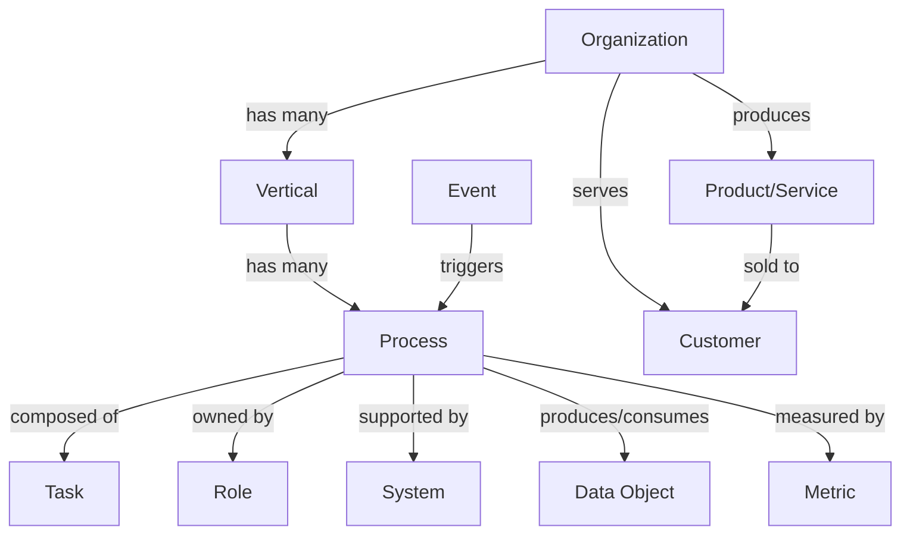
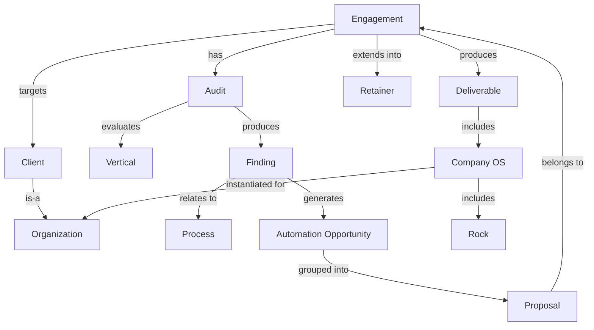

# Business Ontology

A formal entity/relationship model underlying Docs 01-05. It has two layers:

1. **Core Business Ontology** — general-purpose: describes how *any*
   organization works, independent of this consultancy. Usable on its own by
   another analyst or tool.
2. **Engagement Ontology** — an extension layer specific to how this
   consultancy audits, proposes to, and works with a client. Every entity in
   this layer attaches to one or more Core entities rather than replacing
   them.

Everything already written in Docs 01-05 is an instance or application of
this model — this document is what makes the vocabulary in those docs
precise and consistent, and is the reference to update first if a new kind
of entity is needed anywhere else in this folder.

## 1. Core Business Ontology (general-purpose)

### Entities

| Entity | Definition | Key attributes |
|---|---|---|
| **Organization** | Any business or operating entity — a prospect, a client, or the consultancy itself. | name, industry, size, geography, legal structure |
| **Vertical** | A business function an Organization performs (Doc 05's taxonomy: Sales, Marketing, Operations/Service Delivery, Accounting & Finance, Manufacturing/Production, plus expandable ones — HR, Customer Service, IT & Data, Compliance, R&D, E-commerce). | name, definition, applicability (does this Organization have it at all) |
| **Process** | A repeatable sequence of activity within one Vertical (e.g. "lead intake," "invoicing," "batch production"). | name, description, maturity score (1-5), owner |
| **Task** | An atomic step within a Process. | name, sequence order, manual/automated |
| **Role** | A person or position that owns a Process or performs Tasks. One Role can span multiple Verticals; one Vertical typically has one or more Roles. | title, responsibilities, seat (per Doc 02 People component) |
| **System** | A tool (software or manual, e.g. a spreadsheet) that supports a Process. | name, type, integration status, systems it exchanges data with |
| **Data Object** | Information created or consumed by a Process (a lead record, an invoice, a batch/lot record, a booking). | name, source Process, consuming Process(es) |
| **Metric** | A measurable indicator tied to a Process or Vertical (response time, no-show rate, days-to-payment). | name, current value, target, cadence |
| **Event** | A trigger or occurrence that starts or interrupts a Process (new inquiry received, invoice overdue, no-show). | name, triggering Process |
| **Product/Service** | What the Organization sells or produces; the output of Manufacturing/Production and/or Operations, sold via Sales/Marketing. | name, description |
| **Customer** | An external party who consumes a Product/Service; the counterparty of Sales, Marketing, and Operations processes. | name, relationship stage |

### Relationships

- Organization **has many** Vertical (only the applicable ones — see Doc 05's
  mapping table for typical combinations by industry)
- Vertical **has many** Process
- Process **is composed of many** Task
- Process **is owned by** one or more Role
- Process **is supported by** zero or more System
- Process **produces/consumes** zero or more Data Object
- Process **is measured by** one or more Metric
- Event **triggers** Process
- Organization **produces** Product/Service
- Organization **serves** Customer
- Product/Service **is sold to** Customer (via Sales/Marketing Processes)

### Core ontology diagram

## 2. Engagement Ontology (consultancy extension)

These entities are how the consultancy's own practice (Docs 02-04) attaches
to the Core ontology above. Every one of them references a Core entity —
none of them stand alone.

### Entities

| Entity | Definition | Attaches to Core via |
|---|---|---|
| **Client** | An Organization currently engaged (or prospective) as a customer of the consultancy. | is-a **Organization** |
| **Engagement** | A bounded project with a Client, moving through the five stages in Doc 02 §4 (Prospect → Discover & Audit → Propose → Implement → Optimize & Retain). | targets one **Client** |
| **Audit** | An application of the Vertical framework (Doc 05) and audit playbook (Doc 03) to a Client within an Engagement; scores maturity per applicable Vertical/Process. | evaluates a Client's **Vertical**(s) and **Process**(es) |
| **Finding** | A specific observed gap: a Process scored 3 or below, with pain point, hours/week, and revenue-at-risk captured. | relates to one **Process** (and therefore one **Vertical**) |
| **Automation Opportunity** | A proposed automation addressing one or more Findings; scored by impact and effort, phased per Doc 04 (Quick Win / Core System / Advanced). | targets one or more **Process** / **Task** |
| **Proposal** | A prioritized, sequenced set of Automation Opportunities presented to the Client. | groups **Automation Opportunity** records for one **Engagement** |
| **Deliverable** | Any artifact produced during an Engagement — Process Audit Report, built automation, or Company OS. | produced within one **Engagement** |
| **Company OS** | A filled-in instance of the five-part operating system (Doc 02) for a specific Organization — Vision, People, Data, Process, Traction. | instantiates **Role** (People), **Metric** (Data), **Process** (Process), and **Rock** (Traction) for one **Organization** |
| **Rock** | A quarterly priority within a Company OS's Traction component. | tied to one or more **Metric** and/or **Vertical** |
| **Retainer** | The ongoing relationship after Implement, covering monitoring/iteration/support. | follow-on stage of one **Engagement** |

### Relationships

- Client **is-a** Organization
- Engagement **targets** one Client
- Engagement **progresses through** Stage (Prospect, Discover & Audit,
  Propose, Implement, Optimize & Retain)
- Audit **belongs to** one Engagement
- Audit **evaluates** one or more Vertical and their Process(es)
- Audit **produces** one or more Finding
- Finding **relates to** one Process
- Finding **generates** zero or more Automation Opportunity
- Automation Opportunity **is grouped into** one Proposal
- Proposal **belongs to** one Engagement
- Engagement **produces** one or more Deliverable (Process Audit Report,
  Company OS, automation builds)
- Company OS **is instantiated for** one Organization (usually the Client)
- Rock **belongs to** one Company OS
- Retainer **extends** one Engagement past Implement

### Combined diagram

## 3. Where each entity is already used

| Entity | Primarily defined/used in |
|---|---|
| Organization, Customer, Product/Service | Doc 01 (target market) |
| Vertical, Process, Task, System, Data Object, Metric, Event | Doc 05 (vertical framework) |
| Role | Doc 02 §2 (People) |
| Client, Engagement, Audit, Finding | Doc 03 (audit playbook) |
| Automation Opportunity, Proposal | Doc 03 §3, Doc 04 (roadmap) |
| Deliverable, Company OS, Rock | Doc 02 (Company OS + "Delivering the COS to clients") |
| Retainer | Doc 02 §4 stage 5 |

## 4. Extending the ontology

When something new doesn't fit an existing entity, add it here first, then
propagate the term into whichever of Docs 01-05 uses it — don't introduce new
vocabulary directly in those docs without registering it here. Two common
extension points:

- **New Vertical** — add to Doc 05's expandable list, then it's
  automatically a valid child of Organization here.
- **New Deliverable type** — e.g., a training session or a runbook — add as
  a subtype of Deliverable rather than a new top-level entity.
